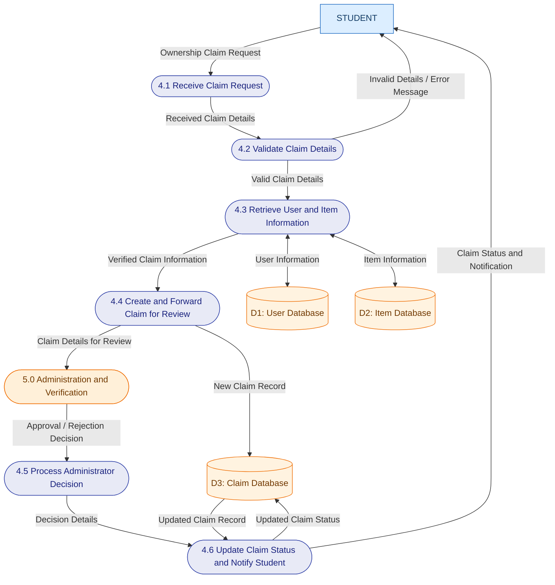

# Data Flow Diagram – Level 2
## Process 4.0: Manage Ownership Claims

```mermaid
flowchart TB
    STUDENT["STUDENT"]
    ADMIN(["5.0 Administration and Verification"])

    P41(["4.1 Receive Claim Request"])
    P42(["4.2 Validate Claim Details"])
    P43(["4.3 Retrieve User and Item Information"])
    P44(["4.4 Create and Forward Claim for Review"])
    P45(["4.5 Process Administrator Decision"])
    P46(["4.6 Update Claim Status and Notify Student"])

    D1[("D1: User Database")]
    D2[("D2: Item Database")]
    D3[("D3: Claim Database")]

    STUDENT -->|"Ownership Claim Request"| P41
    P41 -->|"Received Claim Details"| P42

    P42 -->|"Valid Claim Details"| P43
    P42 -->|"Invalid Details / Error Message"| STUDENT

    P43 <-->|"User Information"| D1
    P43 <-->|"Item Information"| D2
    P43 -->|"Verified Claim Information"| P44

    P44 -->|"New Claim Record"| D3
    P44 -->|"Claim Details for Review"| ADMIN

    ADMIN -->|"Approval / Rejection Decision"| P45
    P45 -->|"Decision Details"| P46

    P46 -->|"Updated Claim Status"| D3
    D3 -->|"Updated Claim Record"| P46

    P46 -->|"Claim Status and Notification"| STUDENT

    style STUDENT fill:#DCEEFF,stroke:#1565C0,color:#123B65
    style ADMIN fill:#FFF0D9,stroke:#EF6C00,color:#713900
    style P41 fill:#E8EAF6,stroke:#3949AB,color:#1A237E
    style P42 fill:#E8EAF6,stroke:#3949AB,color:#1A237E
    style P43 fill:#E8EAF6,stroke:#3949AB,color:#1A237E
    style P44 fill:#E8EAF6,stroke:#3949AB,color:#1A237E
    style P45 fill:#E8EAF6,stroke:#3949AB,color:#1A237E
    style P46 fill:#E8EAF6,stroke:#3949AB,color:#1A237E
    style D1 fill:#FFF3E0,stroke:#EF6C00,color:#713900
    style D2 fill:#FFF3E0,stroke:#EF6C00,color:#713900
    style D3 fill:#FFF3E0,stroke:#EF6C00,color:#713900
```